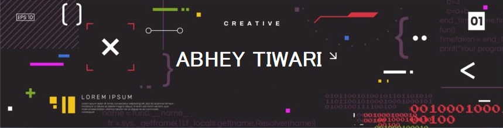

<h1 align="center">Hi 👋, I'm Abhey Tiwari</h1>
<h3 align="center">Abhey | Python & C++ Dev | WordPress | Debater | Environmentalist</h3>

  

<h3 align="left">Connect with me:</h3>

<h3 align="left">Languages and Tools:</h3>

       

